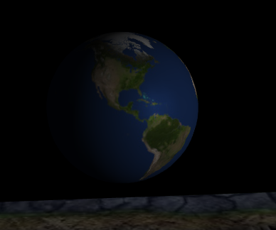
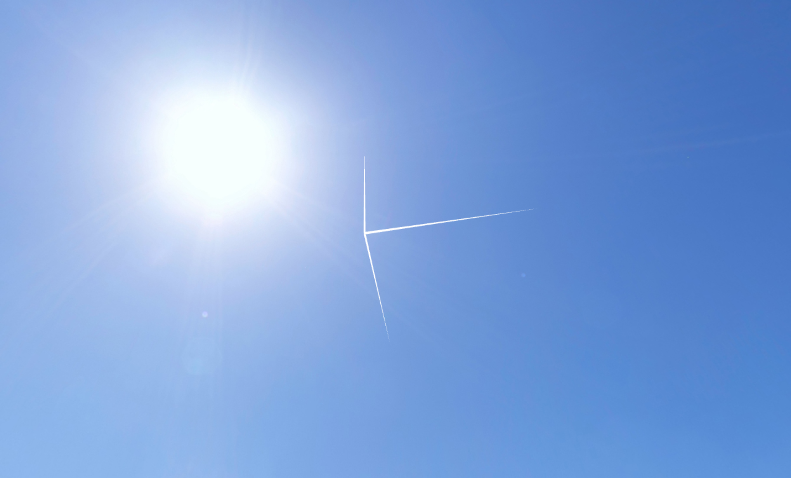
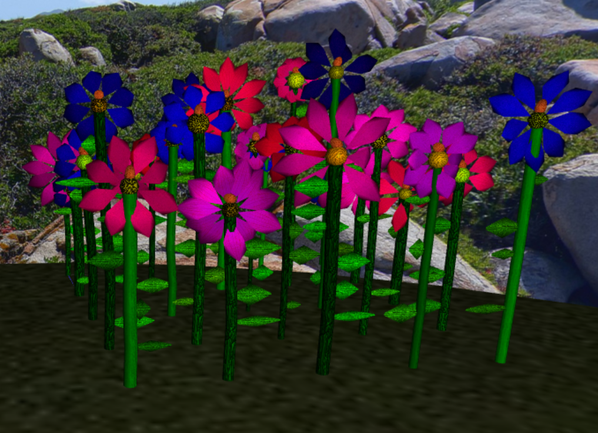
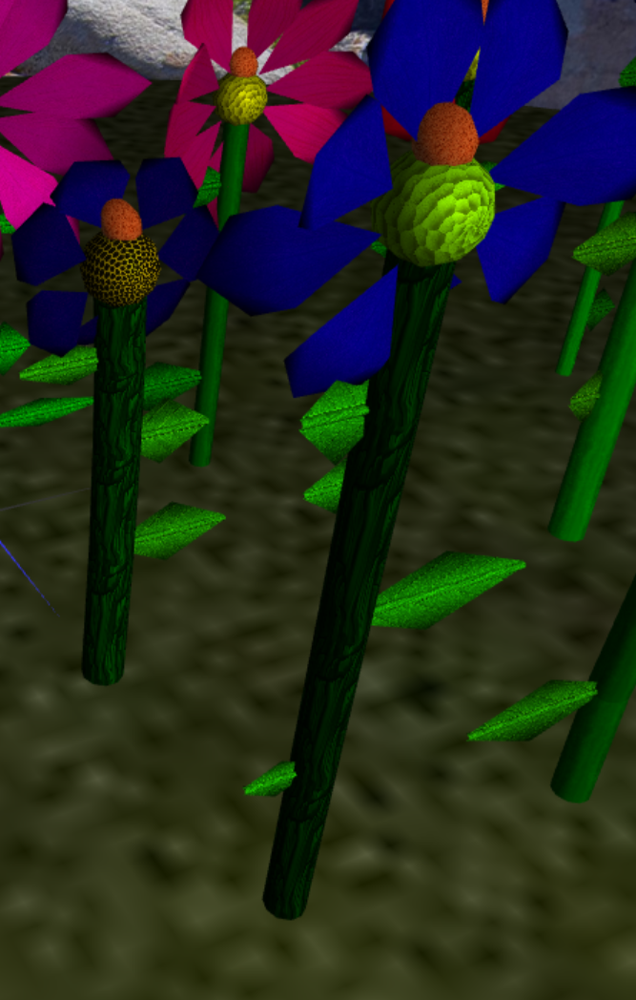
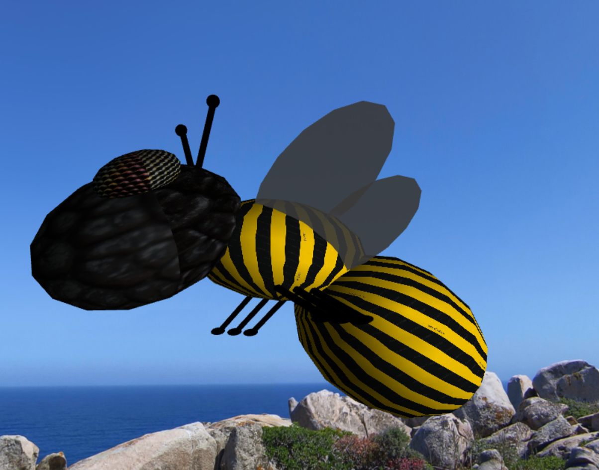
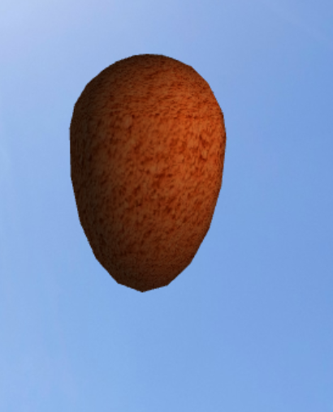
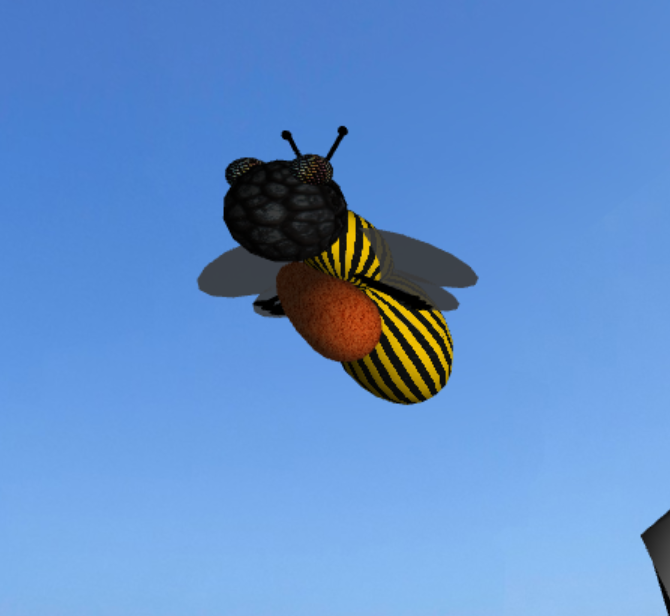
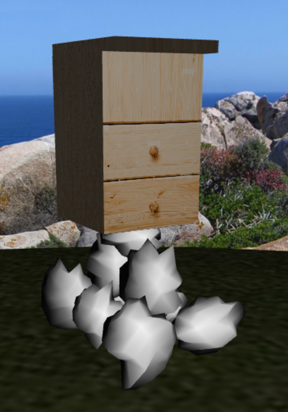
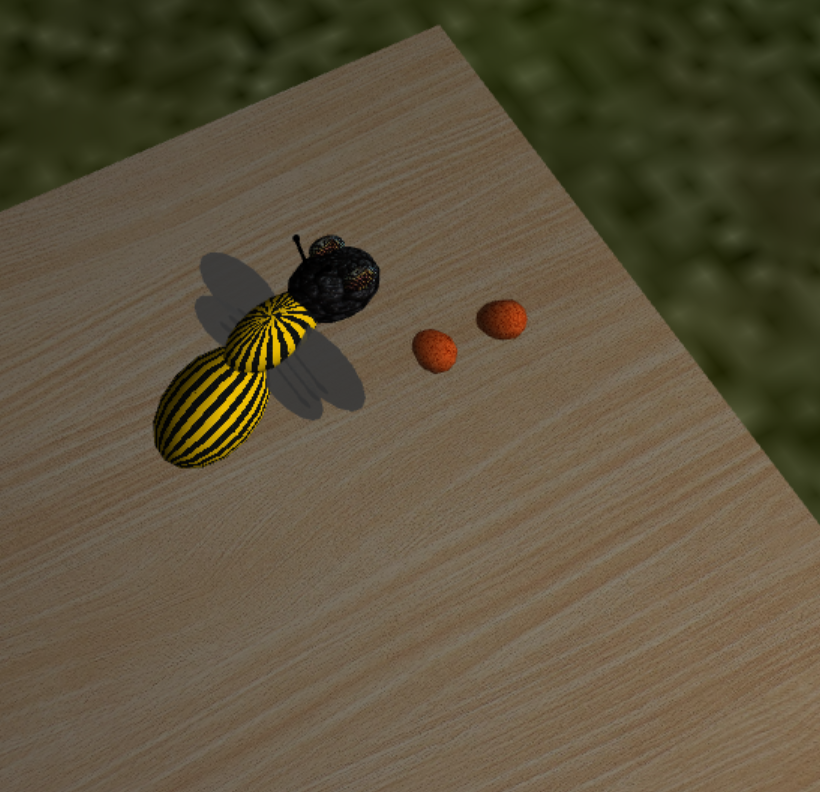
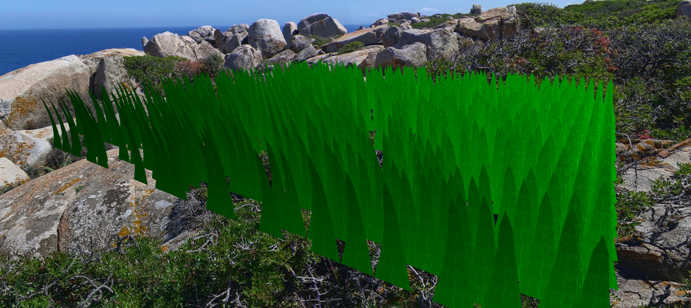

# CG 2023/2024

## Group T12G06

## Project Notes
- We started by developing the sphere as asked and applying the earth texture.

- Then, we adapted the sphere so we could insert a texture on its inside and create a panorama

- We developed the flower. The constructor takes many parameters for its construction, that are then used with random values when building a garden so there's differences in them.

- The rock was made by differing the radius on a sphere's vartices by an offset within a given inteval. The higher the offset interval, the "rockier" the rock. We then generated multiple of these with random scaling to generate a pyramid like structure.

- The bee is composed of scaled spheres, and the antennas and legs are cylinders with spheres on the end. The wings are Ellipses. We added textures we though were appropriate. The wings are animated.

- For the pollen we developed another class resembling MySphere, that takes arguments for the scale of the bottom and upper part. It resulted in an egg like figure.

The hive is a box Hive, with different textures for the respective faces. When the bee goes to store pollen at the hive, it is placed on top of it. Pollens are displayed with random rotation in their class, so we just reference pollen instances across the scene, from flower to bee to hive

The grass is composed of trapezoids. We alter their rotation to givec the impression of a waving movement

