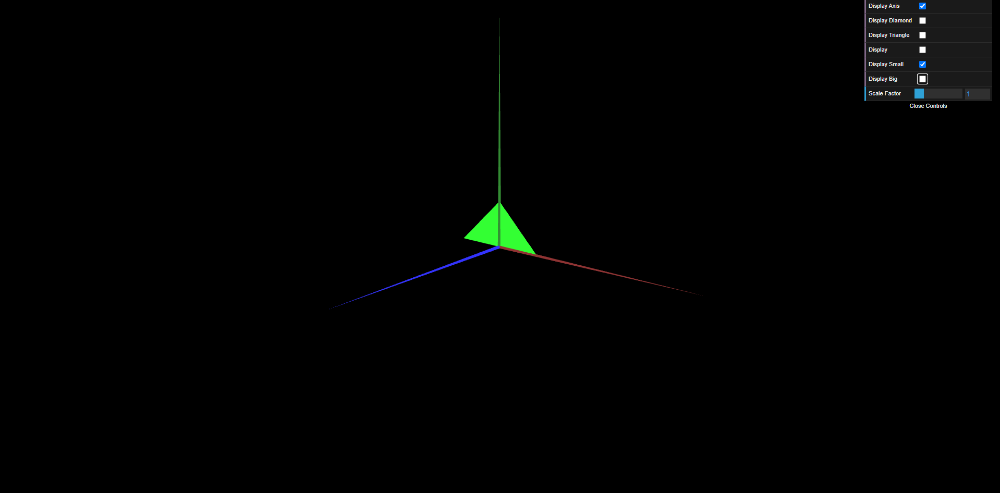

# CG 2023/2024

## Group T12G06

## TP 1 Notes

- We found exercise 1 to be pretty straight forward, the only complexity being making the parallelogram double-sided but that
was solved by simply adding triangles with the vertices in reverse order.
- Exercise 2 was also very straight forward, no difficulties found here.

