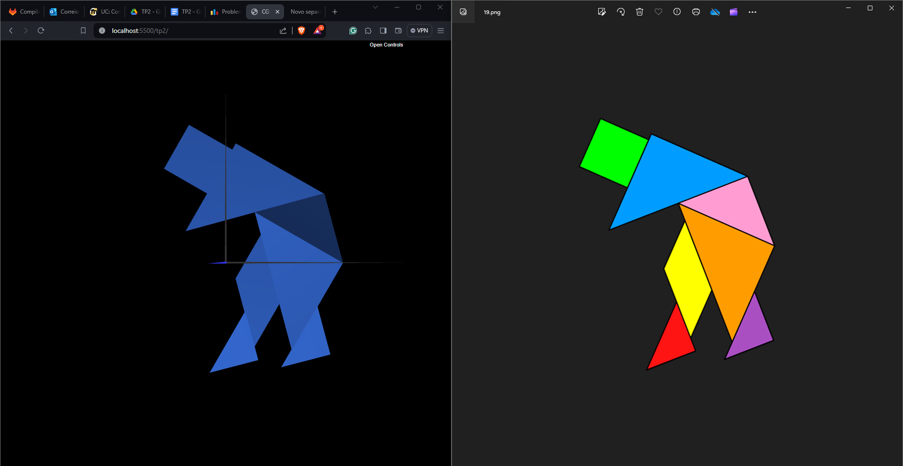
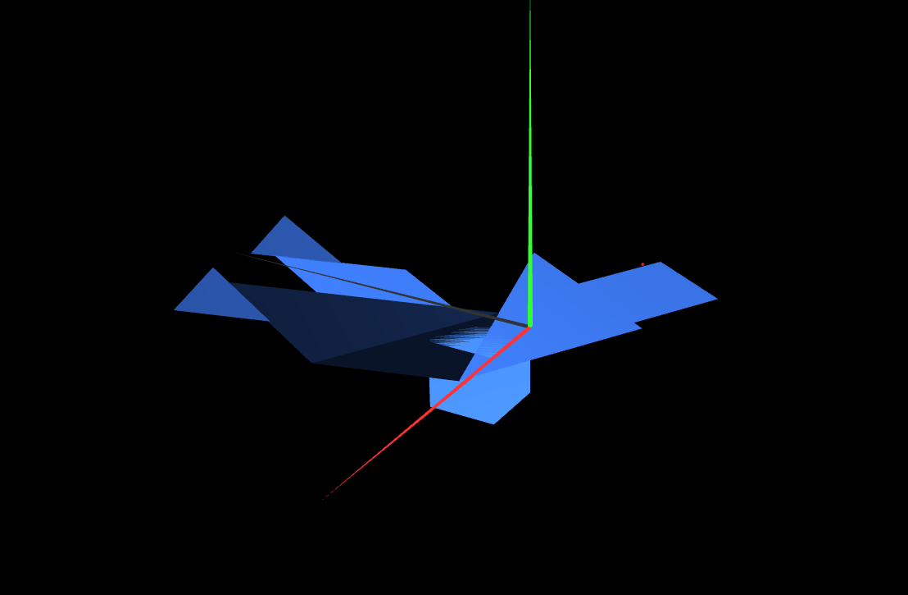

# CG 2023/2024

## Group T12G06

## TP 2 Notes

- The transformations were easy to apply but the values for each of them were hard to discover. In oder to help with that
we added some optinos to the interface to move each of the pieces of the tangram to the correct place and read their values.
After that we just took those values and applied the to the pieces 

- Creating the cube wasn't hard. It helps to keep track of where each vertex is located by using comments and which triangles correspond to each of the faces.
Atatching the cube to the tangram and placing the top left vertex of the cube on the origin was also pretty straight forward.

