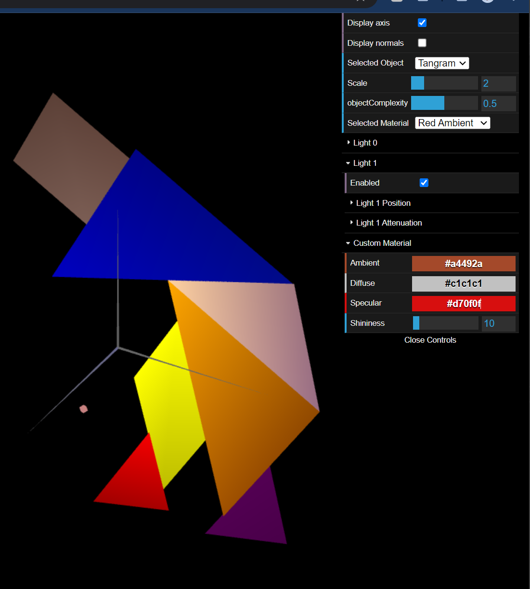

# CG 2023/2024

## Group T12G06

## TP 3 Notes

- After importing the files for the tangram and unit cube, we declared their normals in the respective classes. We then created a brown color with a low specular component, resembling wood. Applied it to th cube and the result is as follows:

- In the MyTangram class, we created and applied the requested colors to the figures. We did this by applying the color of a figure before displaying it, painting it over the color of the previous figure. We then applied the custom material to the diamond and set it to a pinkish tone.

- For the most part, the development of the prism was simple, the most challenging part being the creation of the indices. The lighting is calculated for each of the faces uniformly, making the figure very 'poliedral'. We chose to display the normals in this screenshot to demonstrate the 20 stacks composing the length of the prism.

- In the MyCylinder class we removed duplicate vertices, since we only need a single normal on them. The normals are now perpendicular to the tangents  of that point if the figure were a cylinder. The lighting is now much more seamless, making for a rounder appearence.

