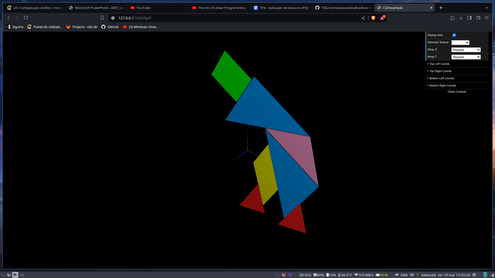

# CG 2023/2024

## Group T12G06

## TP 4 Notes

- After importing the files for the tangram and unit cube, we apllied the texture tangram.png to the tamgram and mapped each of its figures textCoords to the corresponding parts of the texture, resulting in a fully coloured tangram:

