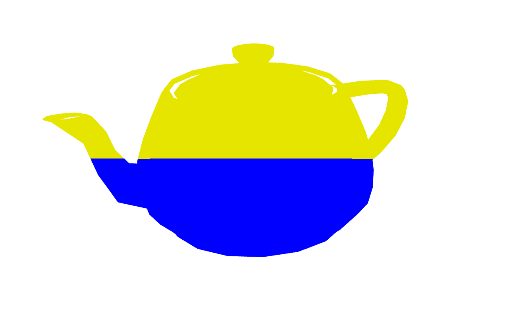
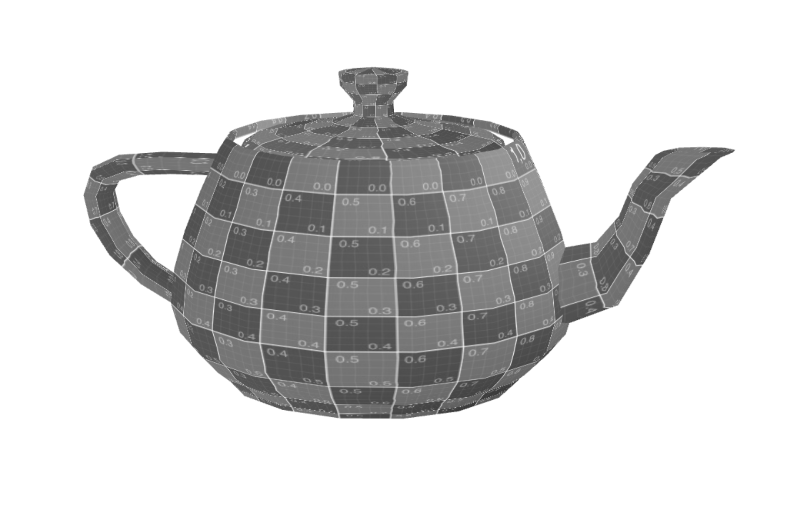

# CG 2023/2024

## Group T12G06

## TP 5 Notes

- We created teapot.vert and teapot.frag and applied the requested colors. We used a variable 'vertex' in the .vert file that stored the position of the vertex, that was then passed to be able to display the colors

- We created gray.frag and applied what was requested. This was simple.

- We created water.frag and water.vert based on texture2 and added the water images. After that we updated the update() function so the animation could be visible

